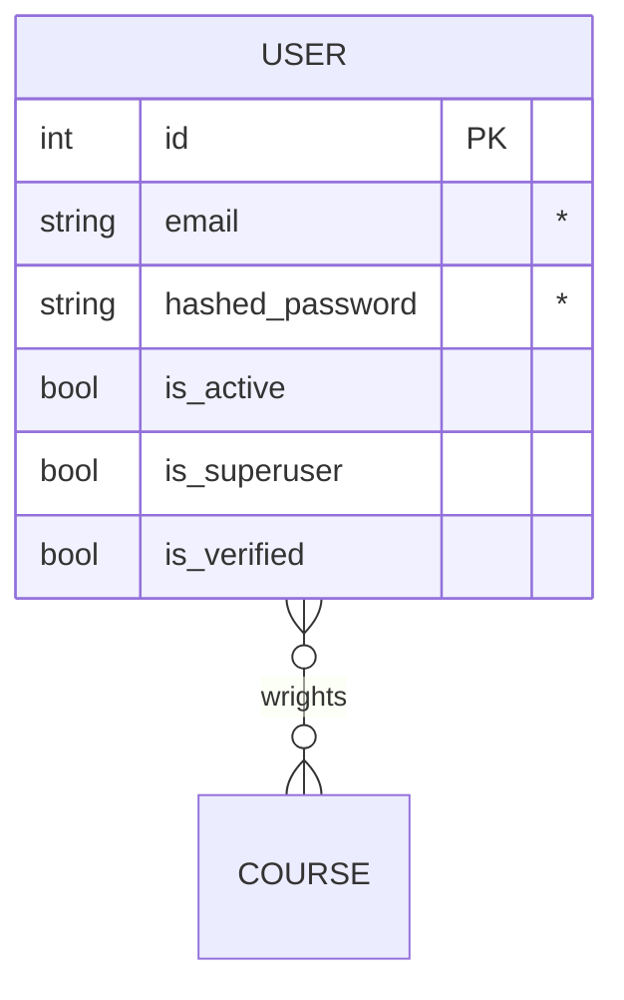

# bot (tg bot)


## Общее описание
_____
### Краткое описание
...


## Техническое описание
_____
### Стек технологий:
  - Python;
  - SQLite/PostgreSQL.

### ER-Diagrams



## Python
_____

### PipENV
```bash
# install pipenv
pip install pipenv
# .venv in fold of the project
$env:PIPENV_VENV_IN_PROJECT=1
# initilization
pipenv shell
# install
pipenv install
```

## Ссылки
_____
[by Yamemik](https://github.com/Yamemik)
